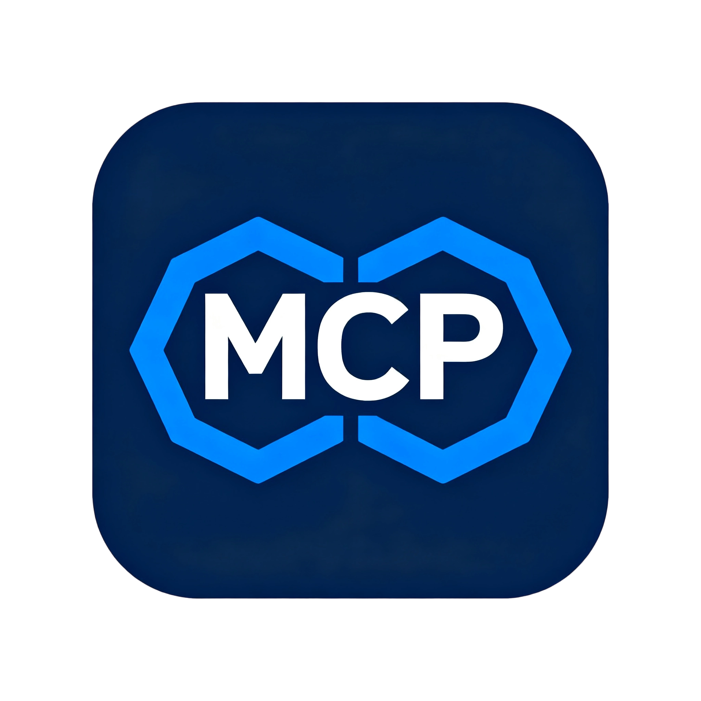

# IDA-MCP



[](https://lobehub.com/mcp/captain-ai-hub-ida-mcp)

[wiki](https://github.com/jelasin/IDA-MCP/wiki) [deepwiki](https://deepwiki.com/jelasin/IDA-MCP)

## IDA-MCP (FastMCP + Multi-instance Coordinator)

* Each IDA instance starts a **FastMCP** server (`/mcp`)
* The first instance occupies `127.0.0.1:11337` as the **coordinator**, maintaining a memory registry and supporting tool forwarding
* Subsequent instances automatically register with the coordinator; no need to share files or manually configure ports
* Unified access / aggregation of instance tools via a modular **proxy** (MCP clients can start it via command/args)

## Architecture

The project uses a modular architecture:

### Core Infrastructure

* `rpc.py` - `@tool` / `@resource` / `@unsafe` decorators and registration
* `sync.py` - `@idaread` / `@idawrite` IDA thread synchronization decorators
* `utils.py` - Address parsing, pagination, pattern filtering utilities
* `compat.py` - IDA 8.x/9.x compatibility layer

### API Modules (IDA Backend)

* `api_core.py` - IDB metadata, function/string/global lists
* `api_analysis.py` - Decompilation, disassembly, cross-references
* `api_memory.py` - Memory reading operations
* `api_types.py` - Type operations (prototypes, local types)
* `api_modify.py` - Comments, renaming
* `api_stack.py` - Stack frame operations
* `api_debug.py` - Debugger control (marked unsafe)
* `api_resources.py` - MCP Resources (`ida://` URI patterns)

### Key Features

* **Decorator Chain Pattern**: `@tool` + `@idaread`/`@idawrite` for clean API definitions
* **Batch Operations**: Most tools accept lists for batch processing
* **MCP Resources**: REST-like `ida://` URI patterns for read-only data access
* **Multi-instance Support**: Coordinator on port 11337 manages multiple IDA instances
* **IDA 8.x/9.x Compatible**: Compatibility layer handles API differences

## Current Tools

### Core Tools (`api_core.py`)

* `check_connection` – Health check (ok/count)
* `list_instances` – List all registered IDA instances
* `get_metadata` – IDB metadata (hash/arch/bits/endian)
* `list_functions` – Paginated function list with optional pattern filter
* `get_function` – Find function by name or address
* `list_globals` – Global symbols (non-functions)
* `list_strings` – Extracted strings
* `list_local_types` – Local type definitions
* `get_entry_points` – Program entry points
* `convert_number` – Number format conversion
* `list_imports` – List imported functions with module names
* `list_exports` – List exported functions/symbols
* `list_segments` – List memory segments with permissions
* `get_cursor` – Get current cursor position and context

### Analysis Tools (`api_analysis.py`)

* `decompile` – Batch decompile functions (Hex-Rays)
* `disasm` – Batch disassemble functions
* `linear_disassemble` – Linear disassembly from arbitrary address
* `xrefs_to` – Batch cross-references to addresses
* `xrefs_from` – Batch cross-references from addresses
* `xrefs_to_field` – Heuristic struct field references
* `find_bytes` – Search for byte patterns with wildcards
* `get_basic_blocks` – Get basic blocks with control flow

### Memory Tools (`api_memory.py`)

* `get_bytes` – Read raw bytes
* `get_u8` / `get_u16` / `get_u32` / `get_u64` – Read integers
* `get_string` – Read null-terminated strings

### Type Tools (`api_types.py`)

* `declare_type` – Create/update local types
* `set_function_prototype` – Set function signature
* `set_local_variable_type` – Set local variable type (Hex-Rays)
* `set_global_variable_type` – Set global variable type
* `list_structs` – List all structures/unions
* `get_struct_info` – Get structure definition with fields

### Modify Tools (`api_modify.py`)

* `set_comment` – Batch set comments
* `rename_function` – Rename function
* `rename_local_variable` – Rename local variable (Hex-Rays)
* `rename_global_variable` – Rename global symbol
* `patch_bytes` – Patch bytes at addresses

### Stack Tools (`api_stack.py`)

* `stack_frame` – Get stack frame variables
* `declare_stack` – Create stack variables
* `delete_stack` – Delete stack variables

### Debug Tools (`api_debug.py`) - Unsafe

* `dbg_regs` – Get all registers
* `dbg_callstack` – Get call stack
* `dbg_list_bps` – List breakpoints
* `dbg_start` – Start debugging
* `dbg_exit` – Terminate debug
* `dbg_continue` – Continue execution
* `dbg_run_to` – Run to address
* `dbg_add_bp` – Add breakpoint
* `dbg_delete_bp` – Delete breakpoint
* `dbg_enable_bp` – Enable/disable breakpoint
* `dbg_step_into` – Step into instruction
* `dbg_step_over` – Step over instruction
* `dbg_read_mem` – Read debugger memory
* `dbg_write_mem` – Write debugger memory

### MCP Resources (`api_resources.py`)

* `ida://idb/metadata` – IDB metadata
* `ida://functions` / `ida://functions/{pattern}` – Functions
* `ida://function/{addr}` – Single function details
* `ida://strings` / `ida://strings/{pattern}` – Strings
* `ida://globals` / `ida://globals/{pattern}` – Global symbols
* `ida://types` / `ida://types/{pattern}` – Local types
* `ida://segments` – Segment list
* `ida://imports` – Import list
* `ida://exports` – Export list
* `ida://xrefs/to/{addr}` – Cross-references to address
* `ida://xrefs/from/{addr}` – Cross-references from address
* `ida://memory/{addr}?size=N` – Read memory

## Directory Structure

```text
IDA-MCP/
  ida_mcp.py              # Plugin entry: start/stop SSE server + register coordinator
  ida_mcp/
    __init__.py           # Package initialization, auto-discovery, exports
    config.py             # Configuration loader (config.conf parser)
    config.conf           # User configuration file
    rpc.py                # @tool/@resource/@unsafe decorators
    sync.py               # @idaread/@idawrite thread sync
    utils.py              # Utility functions
    compat.py             # IDA 8.x/9.x compatibility layer
    api_core.py           # Core API (metadata, lists)
    api_analysis.py       # Analysis API (decompile, disasm, xrefs)
    api_memory.py         # Memory API
    api_types.py          # Type API
    api_modify.py         # Modification API
    api_stack.py          # Stack frame API
    api_debug.py          # Debugger API (unsafe)
    api_resources.py      # MCP Resources
    registry.py           # Coordinator / multi-instance registration
    proxy/                # stdio-based MCP proxy
      __init__.py         # Proxy module exports
      ida_mcp_proxy.py    # Main entry point (stdio MCP server)
      _http.py            # HTTP helpers for coordinator communication
      _state.py           # State management and port validation
      proxy_core.py       # Core forwarding tools
      proxy_analysis.py   # Analysis forwarding tools
      proxy_memory.py     # Memory forwarding tools
      proxy_types.py      # Type forwarding tools
      proxy_modify.py     # Modification forwarding tools
      proxy_stack.py      # Stack frame forwarding tools
      proxy_debug.py      # Debug forwarding tools
    http/                 # HTTP-based MCP proxy (auto-started, reuses stdio proxy)
      __init__.py         # HTTP module exports
      http_server.py      # HTTP transport wrapper (reuses ida_mcp_proxy.server)
  mcp.json                # MCP client configuration (both modes)
  README.md               # README
  requirements.txt        # fastmcp dependencies
```

## Startup Steps

1. Copy `ida_mcp.py` + `ida_mcp` folder to IDA's `plugins/`.
2. Open target binary, wait for analysis to complete.
3. Trigger plugin via menu / shortcut: First launch will:
   * Select free port (starting from 10000) to run SSE service `http://127.0.0.1:<port>/mcp/`
   * If 11337 is free → start coordinator; otherwise register with existing coordinator
4. Trigger plugin again = stop and unregister instance.

## Proxy Usage

The proxy **simultaneously supports both transport modes** - choose whichever works best for your MCP client:

### Transport Modes

| Mode | Description | Configuration |
|------|-------------|---------------|
| **HTTP** (recommended) | Auto-started by coordinator, no subprocess needed | Only requires `url` |
| **stdio** | MCP client launches subprocess | Requires `command` and `args` |

Both modes are always available when the IDA plugin is running.

**Proxy Tools:**

| Category | Tools |
|----------|-------|
| Management | `check_connection`, `list_instances`, `select_instance` |
| Core | `list_functions`, `get_metadata`, `list_strings`, `list_globals`, `list_local_types`, `get_entry_points`, `get_function` |
| Analysis | `decompile`, `disasm`, `linear_disassemble`, `xrefs_to`, `xrefs_from`, `find_bytes`, `get_basic_blocks` |
| Modify | `set_comment`, `rename_function`, `rename_global_variable`, `rename_local_variable` |
| Memory | `get_bytes`, `get_u8`, `get_u16`, `get_u32`, `get_u64`, `get_string` |
| Types | `set_function_prototype`, `set_local_variable_type`, `set_global_variable_type`, `declare_type` |
| Debug | `dbg_start`, `dbg_continue`, `dbg_step_into`, `dbg_step_over`, `dbg_regs`, `dbg_add_bp`, `dbg_delete_bp`, ... |

You can use it on Codex / Claude Code / LangChain / Cursor / VSCode / etc - any MCP client.

### Configuration File

Edit `ida_mcp/config.conf` to customize settings:

```ini
# Coordinator settings
# coordinator_host = "127.0.0.1"
# coordinator_port = 11337

# HTTP proxy settings
# http_host = "127.0.0.1"  # Use 0.0.0.0 for remote access
# http_port = 11338
# http_path = "/mcp"

# IDA instance settings
# ida_default_port = 10000

# General settings
# request_timeout = 30
# debug = false
```

### Method 1: HTTP Mode (Recommended)

HTTP proxy auto-starts when IDA plugin loads. Client only needs URL - no subprocess required.

**Claude / Cherry Studio / Cursor example:**

```json
{
  "mcpServers": {
    "ida-mcp": {
      "url": "http://127.0.0.1:11338/mcp"
    }
  }
}
```

**LangChain example:**

```json
{
  "mcpServers": {
    "ida-mcp": {
      "transport": "streamable-http",
      "url": "http://127.0.0.1:11338/mcp"
    }
  }
}
```

**VSCode example:**

```json
{
  "servers": {
    "ida-mcp": {
      "url": "http://127.0.0.1:11338/mcp"
    }
  }
}
```

### Method 2: stdio Mode

Client launches proxy as subprocess. Useful when HTTP is not available.

**Claude / Cherry Studio / Cursor example:**

```json
{
  "mcpServers": {
    "ida-mcp-proxy": {
      "command": "path of python (IDA's python)",
      "args": ["path of ida_mcp/proxy/ida_mcp_proxy.py"]
    }
  }
}
```

**VSCode example:**

```json
{
  "servers": {
    "ida-mcp-proxy": {
      "command": "path of python (IDA's python)",
      "args": ["path of ida_mcp/proxy/ida_mcp_proxy.py"]
    }
  }
}
```

⚠️ Note: Using VSCode Copilot may result in your account being banned.

## Dependencies

Need to install using IDA's Python environment:

```bash
python -m pip install -r requirements.txt
```

## Development

It's not about having many tools, but about having precise ones; the power of the API is what truly matters. Additionally, the tools should be comprehensive, and the more tools there are, the more obstacles there are for the model to call them. If certain tools can be achieved through existing ones, then those tools are unnecessary. What I need are the missing tools—the ones that existing tools cannot accomplish.

## Future Plans

Add UI interface, support internal model calls, add multi-agent A2A automated reverse engineering functionality after langchain officially updates to 1.0.0.
